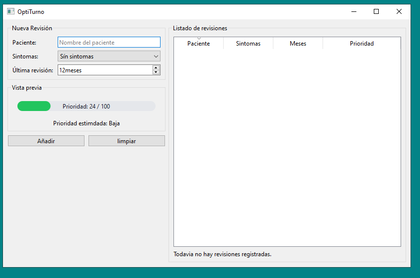
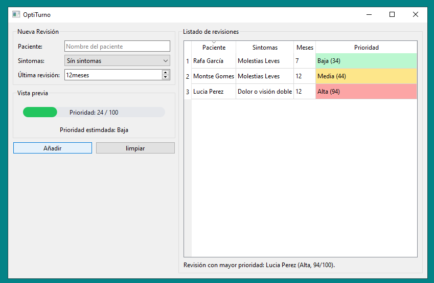

👓 OptiTurno

Aplicación de escritorio desarrollada con Python y PySide6 para registrar revisiones visuales y estimar la prioridad de atención de los pacientes en una consulta óptica.

---

🎯 Problema que resuelve

En una óptica no todas las revisiones tienen la misma urgencia. Algunos pacientes presentan síntomas que requieren una atención más rápida o llevan largos periodos sin realizar una revisión visual.

OptiTurno permite registrar información básica del paciente y calcular una prioridad orientativa de atención, facilitando la organización de la consulta.
---
🖥️ Tecnologías utilizadas
Python
PySide6
Pytest
Programación orientada a objetos
Validación de datos
Git y GitHub
✨ Funcionalidades
Registro de pacientes.
Validación del nombre introducido.
Cálculo automático de prioridad.
Barra visual personalizada de prioridad.
Tabla con pacientes registrados.
Tests unitarios mediante Pytest.
📊 Cálculo de prioridad

La prioridad se estima utilizando:

Nivel de síntomas indicado por el usuario.
Tiempo transcurrido desde la última revisión visual.

El resultado se muestra visualmente mediante una barra de prioridad que facilita la identificación de los casos más urgentes.
---

📸 Capturas de pantalla

<h3>Pantalla principal</h3>

<h3>Listado de Pacientes</h3>

---

🚀 Ejecución
Instalar dependencias
pip install PySide6
pip install pytest
Ejecutar la aplicación
python main.py
✅ Ejecutar los tests
pytest -v
📁 Estructura del proyecto
reto_3
│
├── main.py
├── README.md
│
├── app
│   ├── __init__.py
│   ├── main_window.py
│   ├── models.py
│   ├── validators.py
│   └── widgets.py
│
└── tests
    └── test_logic.py
---
🔮 Posibles mejoras futuras
Persistencia de datos mediante base de datos.
Historial de revisiones por paciente.
Exportación de informes.
Estadísticas de revisiones.
Sistema de clasificación basado en inteligencia artificial.
---
👩‍💻 Autor

Montserrat Gomes Castañar

Proyecto desarrollado como práctica de programación aplicada al ámbito óptico.
